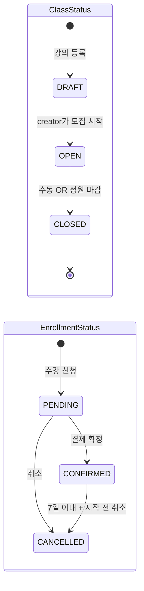
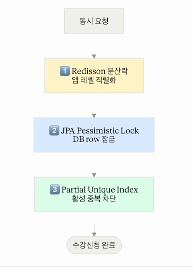

# Live Class Course Registration System

## 프로젝트 개요

정원 한정 강의에 대한 **동시성 안전 수강 신청 시스템**.

핵심 가치는 한 줄: **"100명이 동시에 마지막 한 자리를 노려도 정확히 1명만 성공하고 시스템이 죽지 않는다"** 를 코드·테스트·HTTP 부하 측정 세 단계로 모두 증명한 것.

이를 위해 **3계층 방어**(Redisson 분산락 + JPA `@Lock(PESSIMISTIC_WRITE)` + PostgreSQL partial unique index)를 채택했고, 실제 HTTP 부하에서 **정원 초과 0건 + HikariCP 풀 압박 0** 을 측정으로 보였습니다 ([설계 결정과 이유](#설계-결정과-이유) 참조).

---

## 기술 스택

| 영역 | 도구 |
|---|---|
| 언어 | Java 21 (LTS) |
| 프레임워크 | Spring Boot 3.4.1 |
| ORM | JPA (Hibernate 6) |
| DB | PostgreSQL 16 |
| 캐시·락 | Redis 7 + Redisson 3.39.0 |
| 빌드 | Gradle 8.12 (wrapper 포함) |
| 테스트 | JUnit 5, AssertJ, Testcontainers 1.20.4 |
| 부하 테스트 | k6 0.54.0 + Toxiproxy 2.9.0 |
| 실행 | Docker Compose v2 |

---

## 실행 방법

### 1분 onboarding

```bash
git clone <repo>
cd live-class-course-registration-system
docker compose up --build
```

- PostgreSQL 16 + Redis 7 + 앱이 자동 기동 (~30초)
- 앱: `http://localhost:8080`
- 헬스체크: `curl http://localhost:8080/actuator/health` → `{"status":"UP"}`

### 인프라만 띄우고 앱은 로컬에서

```bash
docker compose up -d postgres redis
./gradlew bootRun
```

### 부하 테스트 실행

```bash
docker compose down
docker compose --profile load-test up -d --build
docker compose exec -T postgres psql -U course -d course_registration < load-test/seed/seed-users.sql
# 시나리오 실행은 load-test/README.md
```

---

## API 목록 및 예시

모든 사용자 식별은 `X-User-Id: <long>` 헤더로. 응답 본문은 JSON.

### 엔드포인트 (총 8개)

| 메서드 | 경로 | 인증 | 설명 |
|---|---|---|---|
| POST | `/api/classes` | `X-User-Id` (creator) | 강의 등록 (DRAFT 생성) |
| PATCH | `/api/classes/{id}/status` | `X-User-Id` (owner) | DRAFT→OPEN, OPEN→CLOSED |
| GET | `/api/classes` | 불필요 | 강의 목록 (status 필터, 페이지네이션) |
| GET | `/api/classes/{id}` | 불필요 | 강의 상세 (`currentCount` 포함) |
| POST | `/api/enrollments` | `X-User-Id` | 수강 신청 (PENDING 생성) |
| POST | `/api/enrollments/{id}/confirm` | `X-User-Id` (owner) | 결제 확정 |
| POST | `/api/enrollments/{id}/cancel` | `X-User-Id` (owner) | 수강 취소 (7일 + 시작 전 가드) |
| GET | `/api/enrollments/me` | `X-User-Id` | 내 신청 목록 (최신순) |

### 요청·응답 예시

**강의 등록**
```bash
curl -X POST http://localhost:8080/api/classes \
  -H "X-User-Id: 1" \
  -H "Content-Type: application/json" \
  -d '{
    "title": "Spring Boot Deep Dive",
    "description": "동시성 제어 심화",
    "price": 99000,
    "capacity": 30,
    "startDate": "2026-06-01",
    "endDate": "2026-06-30"
  }'
```

응답 201:
```json
{ "id": 1, "creatorId": 1, "title": "...", "currentCount": 0, "status": "DRAFT", "createdAt": "..." }
```

**수강 신청**
```bash
curl -X POST http://localhost:8080/api/enrollments \
  -H "X-User-Id: 2" \
  -H "Content-Type: application/json" \
  -d '{ "classId": 1 }'
```

응답 201:
```json
{ "enrollmentId": 100, "classId": 1, "userId": 2, "status": "PENDING", "createdAt": "..." }
```

**내 신청 목록 (페이지네이션)**
```bash
curl "http://localhost:8080/api/enrollments/me?page=0&size=20" \
  -H "X-User-Id: 2"
```

응답 200:
```json
{
  "content": [
    { "enrollmentId": 100, "classId": 1, "userId": 2, "status": "PENDING", "createdAt": "2026-06-01T09:00:00Z" }
  ],
  "page": 0,
  "size": 20,
  "totalElements": 137,
  "totalPages": 7
}
```

### 에러 응답 스키마

```json
{ "code": "CAPACITY_EXCEEDED", "message": "정원이 마감되었습니다." }
```

### 에러 코드

| HTTP | code | 설명 |
|---|---|---|
| 400 | `CLASS_NOT_OPEN` | OPEN 아닌 강의에 신청 |
| 400 | `SELF_ENROLLMENT_FORBIDDEN` | 본인 강의에 본인 신청 |
| 400 | `INVALID_STATUS_TRANSITION` | 허용되지 않은 상태 전이 |
| 400 | `CANCEL_PERIOD_EXPIRED` | CONFIRMED 결제 후 7일 초과 |
| 400 | `CLASS_ALREADY_STARTED` | 강의 시작일 도래 후 취소 시도 |
| 400 | `VALIDATION_FAILED` | 요청 body 검증 실패 |
| 400 | `MISSING_HEADER` | 필수 헤더 누락 |
| 400 | `INVALID_HEADER` | 헤더 값 형식 오류 |
| 403 | `FORBIDDEN` | 타인 리소스 조작 시도 |
| 404 | `NOT_FOUND` | 리소스 없음 |
| 409 | `CAPACITY_EXCEEDED` | 정원 마감 후 신청 |
| 409 | `DUPLICATE_ENROLLMENT` | 활성 중복 신청 |
| 503 | `LOCK_ACQUISITION_FAILED` | 분산락 3초 timeout (의도된 거부) |

검증 순서 일관: **404 → 403 → 400** (존재 → 권한 → 입력).

---

## 데이터 모델 설명

### 엔티티

- **User** — 수강생 겸 크리에이터 통합. role 컬럼 없음, `class.creator_id` 존재 여부로 역할 식별
- **CourseClass** — 강의. 클래스명은 `java.lang.Class` 충돌 회피용, 테이블명은 명세대로 `classes`
- **Enrollment** — 수강 신청 이벤트. 활성·취소 row 모두 보존 (이력 추적)

### 상태 머신



### 스키마 핵심

- `users(id, name, email UNIQUE, created_at)`
- `classes(id, creator_id FK, title, description, price, capacity, current_count, start_date, end_date, status, created_at)`
  - CHECK: `capacity > 0`, `current_count BETWEEN 0 AND capacity`, `end_date >= start_date`, `status IN (...)`, `price >= 0`
- `enrollments(id, user_id FK, class_id FK, status, created_at, confirmed_at?, cancelled_at?)`
  - CHECK: 상태 ↔ 타임스탬프 정합성
- **partial unique index** `uk_active_enrollment ON enrollments(user_id, class_id) WHERE status <> 'CANCELLED'`

### 핵심 불변식

| 불변식 | 보장 방식 |
|---|---|
| `current_count ≤ capacity` 항상 성립 | DB CHECK + 비관적 락 안에서 증가 |
| `(user, class)` 활성 enrollment ≤ 1 | partial unique index |
| OPEN 상태에서만 신청 가능 | 서비스 검증 (락 안에서) |
| 본인 강의에 본인 신청 금지 | 서비스 검증 |
| 정원 도달 시 OPEN → CLOSED 자동 | 동일 트랜잭션 내 도메인 메서드 |
| 상태 전이 단방향 | 도메인 메서드 가드 (setter 미제공) |

ERD 상세는 [ERD — 도메인 모델 상세](https://github.com/PSW99/live-class-course-registration-system/wiki/ERD-%E2%80%94-%EB%8F%84%EB%A9%94%EC%9D%B8-%EB%AA%A8%EB%8D%B8-%EC%83%81%EC%84%B8) 참조.

---

## 요구사항 해석 및 가정


### 자체 추가한 비즈니스 룰

명세에 명시되지 않았으나 시스템 무결성·자연스러움을 위해 추가:

| 추가 룰 | 근거 |
|---|---|
| 본인이 등록한 강의에 본인 신청 금지 (`SELF_ENROLLMENT_FORBIDDEN`) | creator·수강생 통합 모델에서 자연스러운 제약 |
| 활성 (user, class) 중복 신청 금지 (`DUPLICATE_ENROLLMENT`) | "한 사용자가 같은 강의에 두 번 활성 신청"이 의도 외라 봄 |
| CONFIRMED 취소 시 강의 시작일 도래 거부 (`CLASS_ALREADY_STARTED`) | 명세는 "결제 후 7일"만, 시작한 강의 취소는 비합리적이라 보강 |
| 정원 차고 CLOSED된 강의의 자동 재오픈 안 함 | 명세 미정. 보수적으로 creator가 수동 재오픈 가정 |

이 룰들은 평가자 검토에 따라 제거 가능 (별도 이슈로 롤백).

### 인증 모델

- 명세는 "사용자 사전 존재 가정", JWT·로그인은 out-of-scope
- 본 구현은 `X-User-Id` 헤더(long)로 사용자 식별. 실제 서비스라면 인증 미들웨어로 검증되어야 할 값

### 시간

- 모든 타임스탬프는 **UTC** (DB `TIMESTAMPTZ`, Hibernate `jdbc.time_zone=UTC`)
- 서비스 시간 검증은 `Clock` 빈 주입으로 테스트 결정성 확보

### 도메인 명칭

- 명세의 "강의(Class)"는 Java의 `java.lang.Class`와 충돌. 엔티티 클래스명은 `CourseClass`, 테이블명은 `classes`로 분리

---

## 설계 결정과 이유

### 핵심 차별점 — 3계층 방어

본 시스템의 가치는 단일 점에 집중: **정원 한 자리를 노리는 동시 요청을 어떻게 처리할 것인가**.



세 방어선은 **대체재가 아니라 보완재**:

| 단독 사용 | 실패 모드 |
|---|---|
| 분산락만 | 락 만료·split-brain 시 DB 정합성 보장 불가 |
| 비관적 락만 | 커넥션 풀 점유로 HikariCP 고갈 → 시스템 전체 장애 전파 |
| Unique index만 | 정원 ≥ 2일 때 무력 (중복은 막지만 정원은 못 셈) |

### 모든 비즈니스 검증을 락 안에서

LockFacade는 락 획득·해제만 담당. 사전 조회 같은 검증을 LockFacade에 두면 **TOCTOU(Time-Of-Check to Time-Of-Use) 갭**이 노출. 모든 검증·차감은 `Service.enroll()` 한 메서드 안에서.

### 부하 테스트 정량 증명

k6 + Toxiproxy로 HTTP 레벨 부하 측정:

| 시나리오 | 정원 | 동시 요청 | DB latency | 201 | 400 | 503 (의도된) | 다른 5xx | p99 | HikariCP active/pending peak | DB 정합성 |
|---|---|---|---|---|---|---|---|---|---|---|
| S1 | 1 | 100 | 없음 | 1 | 99 | 0 | **0** | 377ms | 0 / 0 | PASS |
| S2 | 1 | 100 | 200ms±50ms | 1 | 10 | 89 | **0** | 5039ms | 1 / 0 | PASS |
| S3 | 5 | 500 | 없음 | 5 | 495 | 0 | **0** | 730ms | 0 / 0 | PASS |

**측정 결론:**
- **정원 초과 0건** — 100명·500명이든 정확히 정원만큼만 성공
- **HikariCP `pending == 0`** — 풀이 한 번도 압박받지 않음. 분산락이 DB 도달 동시성을 1차 직렬화하는 효과 정량 증명
- **의도 외 5xx = 0** — S2의 503 89건은 Redisson 5s `tryLock` 만료의 *의도된* 거부 응답
- **부수 발견** — 대부분의 거부가 `CAPACITY_EXCEEDED`가 아니라 `CLASS_NOT_OPEN`. 첫 성공이 자동 마감을 발동시켜 후속 요청은 모두 CLOSED 강의 거부 경로로 흐름 (설계대로)

상세 환경·재현 절차는 [부하 테스트 결과](https://github.com/PSW99/live-class-course-registration-system/wiki/%EB%B6%80%ED%95%98-%ED%85%8C%EC%8A%A4%ED%8A%B8-%EA%B2%B0%EA%B3%BC) 참조.

---

## 테스트 실행 방법

총 **117 PASSED** · 0 failures · 0 errors.

| 분류 | 디렉토리 | 카운트 | 도구 |
|---|---|---|---|
| 단위 테스트 | `src/test/.../unit/` | 17 | JUnit 5 + AssertJ (no Spring) |
| 통합 테스트 | `src/test/.../integration/` | 96 | Spring Boot + Testcontainers (PG 16) |
| 동시성 테스트 | `src/test/.../concurrency/` | 4 | Testcontainers (PG + Redis) + ExecutorService + CountDownLatch |
| 부하 테스트 | `load-test/scenarios/` | 3 시나리오 | k6 + Toxiproxy (수동 실행) |

### JVM 테스트

```bash
# Docker 데몬이 켜져 있어야 함 (Testcontainers)
./gradlew test

# 전체 빌드
./gradlew build
```

### 부하 테스트 (수동)

```bash
docker compose down
docker compose --profile load-test up -d --build
docker compose exec -T postgres psql -U course -d course_registration < load-test/seed/seed-users.sql
# 시나리오 명령은 load-test/README.md
```

---

## 미구현 / 제약사항

### 선택 구현 중 미구현

| 항목 | 우선순위 | 비고 |
|---|---|---|
| 대기열 (waitlist) | 낮음 | 명세상 "시간 여유 시" 항목 |
| 강의별 수강생 목록 (creator 전용) | 보통 | 별도 권한 모델 필요 |
| PENDING 10분 자동 만료 스케줄러 | 자체 항목 (명세 외) | 도메인 보강 차원, 명세엔 없음 |

---

## AI 활용 범위

 **Claude Code + Claude Opus/Sonnet**을 사용했습니다.

- **하네스 기반 4 에이전트 팀 운영** — backend-architect / spring-boot-developer / test-writer / concurrency-reviewer
- 각 이슈마다 **이슈 작성 → 설계 → 구현 → 테스트 → 영역별 분할 commit → PR 본문 작성** 파이프라인을 AI가 수행

산출물별 AI 비중 표·단계별 검증 방식·솔직한 회고는 [AI 사용 내역](https://github.com/PSW99/live-class-course-registration-system/wiki/AI-%EC%82%AC%EC%9A%A9-%EB%82%B4%EC%97%AD) 참조.

---

## 관련 문서 (wiki)

- [ERD — 도메인 모델 상세](https://github.com/PSW99/live-class-course-registration-system/wiki/ERD-%E2%80%94-%EB%8F%84%EB%A9%94%EC%9D%B8-%EB%AA%A8%EB%8D%B8-%EC%83%81%EC%84%B8)
- [부하 테스트 결과](https://github.com/PSW99/live-class-course-registration-system/wiki/%EB%B6%80%ED%95%98-%ED%85%8C%EC%8A%A4%ED%8A%B8-%EA%B2%B0%EA%B3%BC)
- [AI 사용 내역](https://github.com/PSW99/live-class-course-registration-system/wiki/AI-%EC%82%AC%EC%9A%A9-%EB%82%B4%EC%97%AD)
